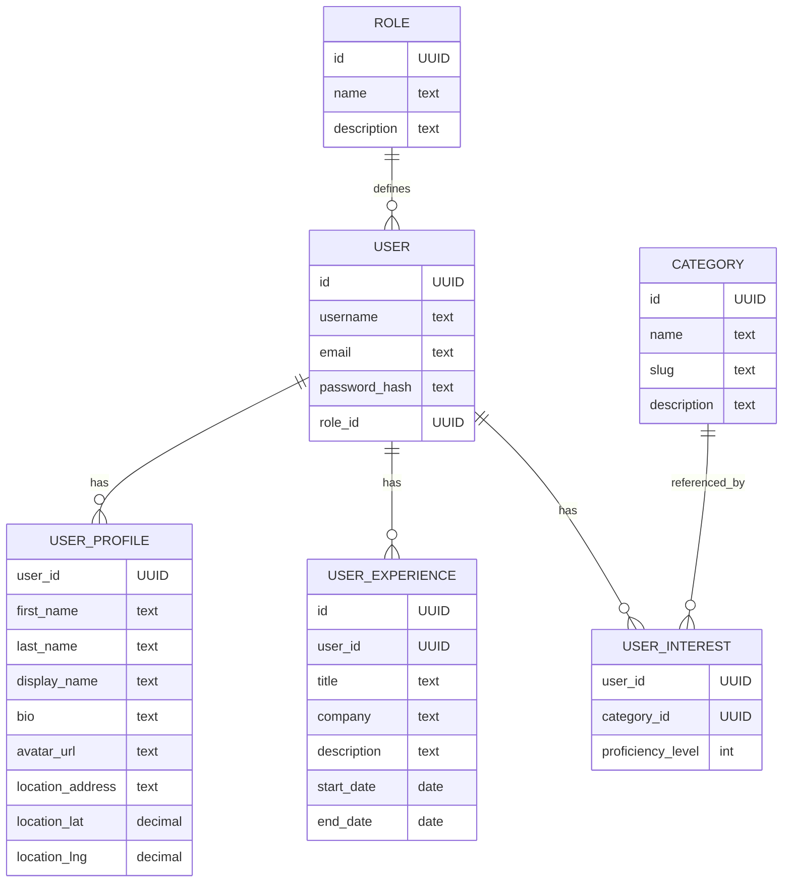

# Back-End Project Documentation

## User Stories (Who, What, Why)

These are the back-end stories for _Usra_ (🐰 user), _Deko_ (🐱 dev),
_Ada_ (🐷 admin) and _Priska_ (🐵 prod engineer).

- 🐵 Priska can check package versions for securing the app.
- 🐵 Priska can check the running status for monitoring the app.
- 🐰 Usra can create a token for authenticating herself.
- 🐰 Usra can check her identity for testing purpose.
- 🐰 Usra can get all her data for compliance.
- 🐰 Usra can register herself for accessing the app.
- 🐷 Ada can CRUDS users for managing them.
- 🐱 Deko can start working to create an app.

## REST API Routes

This initial working app implements the following routes:


| Path | Method | Perms | In | Stat | Out | Comments |
|------|--------|--------|-----|-------|------|-----------|
| `/uptime` | GET | open | | 200 | obj | server health |
| `/info` | GET | adm | sleep? | 200 | obj | system info |
| `/stats` | GET | adm | | 200 | obj | API stats |
| `/login` | GET | auth | | 200 | str | basic auth → token |
| `/login` | POST | auth | login, password | 201 | str | param auth → token |
| `/register` | POST | open | username, email, password | 201/409 | int/- | create user |
| `/who-am-i` | GET | auth | | 200 | str | current user |
| `/myself` | GET | auth | | 200 | obj | full user data |
| `/users` | GET | adm | flt? | 200 | array | list users |
| `/users` | POST | adm | username, email, password, role_id | 201/409 | int | create user |
| `/users/<user_id>` | GET | adm | | 200 | obj | get user |
| `/users/<user_id>` | PATCH | adm | fields? | 204 | - | update user |
| `/users/<user_id>` | DELETE | adm | | 204 | - | delete user |
| `/users/<user_id>/profile` | GET | auth | | 200 | obj | get profile |
| `/users/<user_id>/profile` | PATCH | auth | fields? | 204 | - | update profile |
| `/users/<user_id>/experiences` | GET | auth | | 200 | array | list experiences |
| `/users/<user_id>/experiences` | POST | auth | title, description, dates | 201 | int | add experience |
| `/users/<user_id>/experiences/<exp_id>` | PATCH | auth | fields? | 204 | - | update experience |
| `/users/<user_id>/experiences/<exp_id>` | DELETE | auth | | 204 | - | delete experience |
| `/categories` | GET | open | | 200 | array | list categories |
| `/categories` | POST | adm | name, slug | 201 | int | create category |
| `/categories/<id>` | GET | open | | 200 | obj | get category |
| `/categories/<id>` | PATCH | adm | fields? | 204 | - | update category |
| `/categories/<id>` | DELETE | adm | | 204 | - | delete category |
| `/users/<user_id>/interests` | GET | auth | | 200 | array | list interests |
| `/users/<user_id>/interests` | POST | auth | category_id, weight | 201 | int | add interest |
| `/users/<user_id>/interests/<interest_id>` | PATCH | auth | weight? | 204 | - | update interest |
| `/users/<user_id>/interests/<interest_id>` | DELETE | auth | | 204 | - | delete interest |
| `/paps` | GET | open | filters? | 200 | array | list paps |
| `/paps` | POST | auth | title, subtitle, desc, location, payment… | 201 | int | create paps |
| `/paps/<paps_id>` | GET | open | | 200 | obj | get paps |
| `/paps/<paps_id>` | PATCH | auth | fields? | 204 | - | update paps |
| `/paps/<paps_id>` | DELETE | auth | | 204 | - | delete paps |
| `/paps/<paps_id>/media` | GET | open | | 200 | array | list media |
| `/paps/<paps_id>/media` | POST | auth | file, type | 201 | int | upload media |
| `/paps/<paps_id>/media/<media_id>` | DELETE | auth | | 204 | - | delete media |
| `/paps/<paps_id>/categories` | GET | open | | 200 | array | list categories |
| `/paps/<paps_id>/categories` | POST | auth | category_id | 201 | int | add category |
| `/paps/<paps_id>/categories/<pc_id>` | DELETE | auth | | 204 | - | remove category |
| `/paps/<paps_id>/schedule` | GET | auth | | 200 | array | list schedules |
| `/paps/<paps_id>/schedule` | POST | auth | recurrence fields | 201 | int | create schedule |
| `/paps/<paps_id>/schedule/<sched_id>` | PATCH | auth | fields? | 204 | - | update schedule |
| `/paps/<paps_id>/schedule/<sched_id>` | DELETE | auth | | 204 | - | delete schedule |
| `/paps/<paps_id>/comments` | GET | open | | 200 | array | list comments |
| `/paps/<paps_id>/comments` | POST | auth | content, parent? | 201 | int | add comment |
| `/comments/<comment_id>` | PATCH | auth | content? | 204 | - | edit comment |
| `/comments/<comment_id>` | DELETE | auth | | 204 | - | soft delete |
| `/paps/<paps_id>/spaps` | GET | auth | | 200 | array | list applications |
| `/paps/<paps_id>/spaps` | POST | auth | title, subtitle, message, media… | 201 | int | apply |
| `/spap/<spap_id>` | GET | auth | | 200 | obj | get spap |
| `/spap/<spap_id>` | PATCH | auth | status? | 204 | - | update spap |
| `/spap/<spap_id>` | DELETE | auth | | 204 | - | withdraw spap |
| `/spap/<spap_id>/media` | POST | auth | file | 201 | int | upload media |
| `/spap/<spap_id>/media/<media_id>` | DELETE | auth | | 204 | - | delete media |
| `/asap` | GET | auth | filters? | 200 | array | list asaps |
| `/asap/<asap_id>` | GET | auth | | 200 | obj | get asap |
| `/asap/<asap_id>` | PATCH | auth | status, dates… | 204 | - | update asap |
| `/asap/<asap_id>/media` | POST | auth | file | 201 | int | upload asap media |
| `/asap/<asap_id>/media/<media_id>` | DELETE | auth | | 204 | - | delete asap media |
| `/asap/<asap_id>/assignees` | GET | auth | | 200 | array | list assignees |
| `/asap/<asap_id>/assignees` | POST | auth | user_id, role | 201 | int | assign user |
| `/asap/<asap_id>/assignees/<assign_id>` | DELETE | auth | | 204 | - | remove assignee |
| `/asap/<asap_id>/payments` | GET | auth | | 200 | array | list payments |
| `/asap/<asap_id>/payments` | POST | auth | amount, method | 201 | int | create payment |
| `/payments/<payment_id>` | GET | auth | | 200 | obj | get payment |
| `/payments/<payment_id>` | PATCH | adm | status? | 204 | - | update payment |
| `/asap/<asap_id>/ratings` | GET | auth | | 200 | array | list ratings |
| `/asap/<asap_id>/ratings` | POST | auth | score, review | 201 | int | create rating |
| `/ratings/<rating_id>` | GET | auth | | 200 | obj | get rating |
| `/spap/<spap_id>/chat` | GET | auth | | 200 | obj | get chat thread |
| `/asap/<asap_id>/chat` | GET | auth | | 200 | obj | get chat thread |
| `/chat/<thread_id>/participants` | GET | auth | | 200 | array | list participants |
| `/chat/<thread_id>/participants` | POST | auth | user_id | 201 | int | add participant |
| `/chat/<thread_id>/participants/<pid>` | DELETE | auth | | 204 | - | remove participant |
| `/chat/<thread_id>/messages` | GET | auth | | 200 | array | list messages |
| `/chat/<thread_id>/messages` | POST | auth | content, attachment? | 201 | int | send message |
| `/chat/messages/<msg_id>` | PATCH | auth | is_read | 204 | - | mark read |


> ⚠ All routes may throw:
> - _400_ on bad parameters
> - _401_ on bad authentication
> - _403_ on insufficient privileges
> - _404_ on missing objects
> - _405_ on unimplemented methods

> 💡 `/users` routes are preliminary for testing and can be disabled with `APP_USERS = False`.
> the `/uptime` route is disabled with `APP_TESTING = False`.

> :warning: Flask default `/static` route is disactivated.

## Output JSON Models

JSON Model is a (simple) JSON representation of a JSON data structure based on
_type inference_.
See [paper](https://www.cri.minesparis.psl.eu/classement/doc/A-817.pdf) and
[tools](https://github.com/clairey-zx81/json-model).

- `GET /info`

  ```json
  {
    "#": "abundant data about the application",
    "app": "",
    "git": { "remote": "", "branch": "", "commit": "", "date": "$DATE" },
    "authentication": { "config": [""], "user": "", "auth": "" },
    "db": { "type": "", "driver": "", "version": "" }
    "status": { "started": "$TIMESTAMP", "now": "$TIMESTAMP", "connections": 0, "hits": 0.0 },
    "version": { "uname": "", "python": "", "postgres": "", "psycopg": "", "": "" }
  }
  ```

- `GET /stats`

  ```json
  {
    "#": "approximate description of returned statistics",
    "$": {
      "connection": {
        "last_get": 0.0,
        "last_ret": 0.0,
        "uses": 0,
        "stats": {
          "id": 0,
          "calls": { "": 0 },
          "conn": { "": "$SCALAR" },
          "info": [ "" ],
          "driver": "",
          "ntx": 0,
          "total": 0,
          "count": 0
        }
      }
    },
    "id": 0,
    "avail": [ "$connection" ],
    "using": [ "$connection" ]
    "sem": { "init": 0, "value": 0 },
    "": "$SCALAR"
  }
  ```

- `GET /users`

  ```json
  [ { "login": "/\\w+/", "email": "$optEMAIL", "is_admin": true } ]
  ```

- `GET /users/<login>`

  ```json
  { "aid": "uuid-string", "login": "/\\w+/", "email": "$optEMAIL", "is_admin": true }
  ```

- `GET /myself`

  ```json
  { "aid": "uuid-string", "login": "/\\w+/", "password": "", "email": "$optEMAIL", "is_admin": true }
  ```

- `GET /users/<login>/profile`

  ```json
  {
    "user_id": "uuid-string",
    "first_name": "string",
    "last_name": "string",
    "display_name": "string",
    "bio": "string",
    "avatar_url": "string",
    "date_of_birth": "date",
    "location_address": "string",
    "location_lat": 0.0,
    "location_lng": 0.0,
    "timezone": "string",
    "preferred_language": "string"
  }
  ```

- `GET /users/<login>/experiences`

  ```json
  [
    {
      "id": "uuid-string",
      "user_id": "uuid-string",
      "title": "string",
      "company": "string",
      "description": "string",
      "start_date": "date",
      "end_date": "date",
      "is_current": false,
      "display_order": 0
    }
  ]
  ```

- `GET /categories`

  ```json
  [
    {
      "id": "uuid-string",
      "name": "string",
      "slug": "string",
      "description": "string",
      "parent_id": "uuid-string",
      "icon_url": "string",
      "display_order": 0,
      "is_active": true
    }
  ]
  ```

- `GET /users/<login>/interests`

  ```json
  [
    {
      "user_id": "uuid-string",
      "category_id": "uuid-string",
      "proficiency_level": 1,
      "category_name": "string",
      "category_slug": "string"
    }
  ]
  ```

- `GET /who-am-i` returns `""`

## Database Model

The database uses a `USER` and `ROLE` based schema. Each user has:
- A unique username and email
- A password hash
- A role (admin, worker, poster, moderator)
- An optional profile with extended information
- Experiences (work history)
- Interests (category preferences)



See [`create.sql`](create.sql) for complete schema details.
