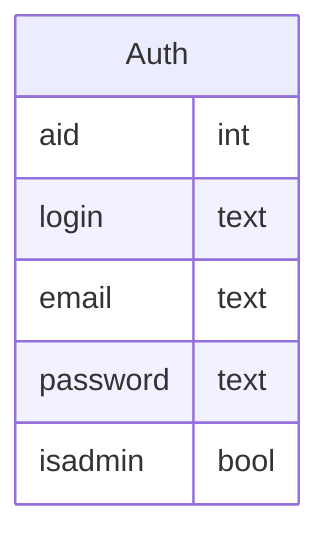

# Back-End Project Documentation

## User Stories (Who, What, Why)

These are the back-end stories for _Usra_ (🐰 user), _Deko_ (🐱 dev),
_Ada_ (🐷 admin) and _Priska_ (🐵 prod engineer).

- 🐵 Priska can check package versions for securing the app.
- 🐵 Priska can check the running status for monitoring the app.
- 🐰 Usra can create a token for authenticating herself.
- 🐰 Usra can check her identity for testing purpose.
- 🐰 Usra can get all her data for compliance.
- 🐰 Usra can register herself for accessing the app.
- 🐷 Ada can CRUDS users for managing them.
- 🐱 Deko can start working to create an app.

## REST API Routes

This initial working app implements the following routes:

| Path             | Method   | Perms  | In          | Stat | Out | Comments |
|---               |---       |---     |---          |---   |---  |---       |
| `/uptime`        | `GET`    | *open* |             |  200 | obj | is the server is running? |
| `/info`          | `GET`    | *adm*  | `sleep`?    |  200 | obj | application setup, with delay |
| `/stats`         | `GET`    | *adm*  |             |  200 | obj | show query call counts |
| `/login`         | `GET`    | *auth* |             |  200 | str | basic auth to token |
|                  | `POST`   | *auth* | `login`<br>`password` | 201 | str | param auth to token |
| `/who-am-i`      | `GET`    | *auth* |             |  200 | str | show authenticated user login |
| `/myself`        | `GET`    | *auth* |             |  200 | obj | show authenticated user data |
| `/register`      | `POST`   | *open* | `login`<br>`password` | 201<br>409 | int<br>- | register a new user<br>exists |
| `/users`         | `GET`    | *adm*  | `flt`?      |  200 | array | show all users |
|                  | `POST`   | *adm*  | `login`<br>`password`<br>`is_admin` | 201<br>409 | int<br>- | create a user<br>exists |
| `/users/<login>` | `GET`    | *adm*  |                            | 200 | obj | show user |
|                  | `PATCH`  | *adm*  | `password`?<br>`is_admin`? | 204 |   - | change user |
|                  | `DELETE` | *adm*  |                            | 204 |   - | delete user |

> ⚠ All routes may throw:
> - _400_ on bad parameters
> - _401_ on bad authentication
> - _403_ on insufficient privileges
> - _404_ on missing objects
> - _405_ on unimplemented methods

> 💡 `/users` routes are preliminary for testing and can be disabled with `APP_USERS = False`.
> the `/uptime` route is disabled with `APP_TESTING = False`.

> :warning: Flask default `/static` route is disactivated.

## Output JSON Models

JSON Model is a (simple) JSON representation of a JSON data structure based on
_type inference_.
See [paper](https://www.cri.minesparis.psl.eu/classement/doc/A-817.pdf) and
[tools](https://github.com/clairey-zx81/json-model).

- `GET /info`

  ```json
  {
    "#": "abundant data about the application",
    "app": "",
    "git": { "remote": "", "branch": "", "commit": "", "date": "$DATE" },
    "authentication": { "config": [""], "user": "", "auth": "" },
    "db": { "type": "", "driver": "", "version": "" }
    "status": { "started": "$TIMESTAMP", "now": "$TIMESTAMP", "connections": 0, "hits": 0.0 },
    "version": { "uname": "", "python": "", "postgres": "", "psycopg": "", "": "" }
  }
  ```

- `GET /stats`

  ```json
  {
    "#": "approximate description of returned statistics",
    "$": {
      "connection": {
        "last_get": 0.0,
        "last_ret": 0.0,
        "uses": 0,
        "stats": {
          "id": 0,
          "calls": { "": 0 },
          "conn": { "": "$SCALAR" },
          "info": [ "" ],
          "driver": "",
          "ntx": 0,
          "total": 0,
          "count": 0
        }
      }
    },
    "id": 0,
    "avail": [ "$connection" ],
    "using": [ "$connection" ]
    "sem": { "init": 0, "value": 0 },
    "": "$SCALAR"
  }
  ```

- `GET /users`

  ```json
  [ { "login": "/\\w+/", "email": "$optEMAIL", "isadmin": true } ]
  ```

- `GET /users/<login>`

  ```json
  { "aid": 1, "login": "/\\w+/", "email": "$optEMAIL", "isadmin": true }
  ```

- `GET /myself`

  ```json
  { "aid": 1, "login": "/\\w+/", "password": "", "email": "$optEMAIL", "isadmin": true }
  ```

- `GET /who-am-i` returns `""`

## Database Model

Table `Auth` holds user accounts.



See [`create.sql`](create.sql) for details.
